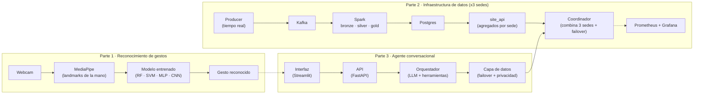

# Sistema Multimodal de Asistencia al Analista de Datos

Tres pruebas de concepto independientes para el sistema de analítica de una
startup de transporte (VTC y taxi):

1. **Reconocimiento de gestos** — interfaz gestual (visión por computador).
2. **Infraestructura de datos** — ingesta, procesamiento distribuido y acceso a resultados.
3. **Agente conversacional** — chatbot que responde preguntas sobre los datos.

Cada parte funciona por separado. Este README explica **qué es cada una y
cómo levantarla de forma reproducible**. Los detalles están en el README de
cada carpeta.

---

## Arquitectura



El agente de la parte 3 consulta los datos de la parte 2 **solo a través del
coordinador**. La parte 1 puede integrarse como interfaz gestual (opcional).

---

## Las tres partes

| Parte | Qué hace | Carpeta |
|---|---|---|
| **1 · Gestos** | Reconoce ≥5 gestos con la webcam a partir de landmarks de MediaPipe; compara varios modelos (RF, SVM, MLP, CNN). | [`parte1_reconocimiento_gestos/`](parte1_reconocimiento_gestos/) |
| **2 · Infraestructura** | Pipeline distribuido por sedes: producer → Kafka → Spark (bronze/silver/gold) → Postgres → API por sede → coordinador con failover, más observabilidad. | [`parte2_infraestructura_datos/`](parte2_infraestructura_datos/README.md) |
| **3 · Agente** | Chatbot (LLM + tool calling) que responde en lenguaje natural sobre los datos de la parte 2, con interfaz web. | [`parte3_agente_conversacional/`](parte3_agente_conversacional/README.md) |

---

## Puesta en marcha

```bash
git clone https://github.com/AlfonsoJimena/multimodal-analyst-assistant.git
cd multimodal-analyst-assistant
```

Requisitos: **Python 3.12** (parte 1) y **Docker** con Docker Compose v2
(partes 2 y 3). Las partes 2 y 3 se levantan con scripts en la raíz del repo.

### Parte 1 — Reconocimiento de gestos

Necesita webcam. En Ubuntu/WSL, instala las librerías del sistema y, en WSL2,
pasa la cámara a Linux (ver `parte1_reconocimiento_gestos/Setup_webcam.md`):

```bash
sudo apt install libgles2 libegl1 libgl1
```

Entorno y ejecución del demo (desde la carpeta de la parte 1):

```bash
cd parte1_reconocimiento_gestos
python3 -m venv .venv && source .venv/bin/activate
pip install -r requirements.txt
python HAR_mediapipe/src/demo-multimodelo.py --model rf   # rf · svm · mlp · cnn1 · cnn2 · ft1 · ft2
```

En la ventana: `m` cambia de modelo, `n` alterna la normalización, `q` sale.

### Parte 2 — Infraestructura de datos

Un único script levanta las tres sedes, los coordinadores y la
monitorización. Antes, coloca el dataset y prepáralo:

```bash
cd parte2_infraestructura_datos
python3 -m venv .venv && source .venv/bin/activate
pip install -r requirements-dev.txt
# coloca el CSV de entrada en data/raw/rows.csv y reparte por sede:
python -m scripts.prepare_data
cd ..
```

Levanta todo (con **Docker en marcha**):

```bash
./start_infra.sh            # (./start_infra.sh --open abre Grafana y Prometheus)
```

- APIs de sede: http://localhost:8000 · 8001 · 8002
- Coordinadores: http://localhost:8100 · 8101 · 8102
- Grafana: http://localhost:3000 (admin/admin) · Prometheus: http://localhost:9090

Comprobaciones y tests:

```bash
cd parte2_infraestructura_datos
make failover-check        # el coordinador responde (con failover)
pytest                     # tests sin Docker (M1 disponibilidad, M2 no fuga, M3 exactitud)
pytest --integration       # además, contra el despliegue en marcha
```

Guía completa: [`parte2_infraestructura_datos/README.md`](parte2_infraestructura_datos/README.md).

### Parte 3 — Agente conversacional

Configura la clave de OpenRouter en el `.env` y levanta el chatbot. El modo
**`--mock`** no necesita la parte 2 (sirve datos fijos con el mismo contrato):

```bash
cd parte3_agente_conversacional
cp .env.example .env         # edita OPENROUTER_API_KEY
cd ..
./start_chatbot.sh --mock    # chatbot contra el coordinador mock
# ./start_chatbot.sh         # contra la parte 2 real (requiere ./start_infra.sh antes)
# añade --open para abrir la interfaz en el navegador
```

- Interfaz: **http://localhost:8501** · API: http://localhost:8300 · mock: http://localhost:8190

Guía completa: [`parte3_agente_conversacional/README.md`](parte3_agente_conversacional/README.md).

### Parar todo

```bash
./stop_all.sh               # para parte 3, monitorización y parte 2 (conserva los datos)
```

---

## Estructura del repositorio

```
.
├── start_infra.sh                  # levanta la parte 2 (sedes + coordinadores + monitorizacion)
├── start_chatbot.sh                # levanta la parte 3 (chatbot; --mock sin la parte 2)
├── stop_all.sh                     # para las partes 2 y 3
├── parte1_reconocimiento_gestos/   # gestos: common/, HAR_mediapipe/ (src, modelos, notebooks)
├── parte2_infraestructura_datos/   # pipeline por sedes + coordinador + observabilidad (Makefile, deploy/, src/)
├── parte3_agente_conversacional/   # chatbot: src/ (api, agent, tools, data, ui), mock/, despliegue/, tests/
├── README.md
└── LICENSE
```

---

## Licencia

Ver [`LICENSE`](LICENSE).
