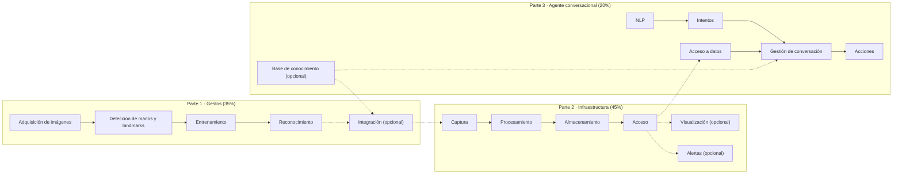

<div align="center">

# Sistema Multimodal de Asistencia al Analista de Datos

**Proyecto 1 · Asignatura _Proyectos en Ingeniería de Datos y Sistemas (PIDS)_**
Universidad Politécnica de Madrid (UPM) — Curso 2026/2027

*Reconocimiento de gestos, infraestructura de datos y un agente conversacional, al servicio de una startup de VTC/taxi.*


</div>

---

## Índice

- [Contexto académico](#contexto-academico)
- [Descripción del proyecto](#descripcion-del-proyecto)
- [Arquitectura de referencia](#arquitectura-de-referencia)
- [Requisitos mínimos](#requisitos-minimos)
- [Retos técnicos](#retos-tecnicos)
- [Tecnologías de referencia](#tecnologias-de-referencia)
- [Organización del equipo](#organizacion-del-equipo)
- [Estructura del repositorio](#estructura-del-repositorio)
- [Primeros pasos](#primeros-pasos)
- [Formato de entrega](#formato-de-entrega)
- [Flujo de trabajo (Git)](#flujo-de-trabajo)
- [Planificación](#planificacion)
- [Criterios de evaluación](#criterios-de-evaluacion)
- [Próximos pasos sugeridos](#proximos-pasos-sugeridos)
- [Documentación](#documentacion)
- [Licencia](#licencia)

---

<a id="descripcion-del-proyecto"></a>
## Descripción del proyecto

Una pequeña **startup del sector del transporte (VTC y taxi)** ha pedido ayuda para diseñar tres partes de su futuro sistema de analítica de datos. El equipo desarrollará **tres pruebas de concepto independientes**:

1. **Sistema de reconocimiento de gestos** — interfaz gestual para interactuar con el sistema.
2. **Infraestructura de captura y análisis de datos** — el motor de datos: ingesta, procesamiento y acceso a resultados.
3. **Sistema de bots conversacionales** — agente capaz de responder preguntas y ejecutar acciones sobre los datos.

> Cada parte debe funcionar como una PoC independiente. Integrarlas entre sí se valora positivamente, pero **no es obligatorio**.

---

<a id="arquitectura-de-referencia"></a>
## Arquitectura de referencia

Esquema **orientativo** (adaptado del material de la asignatura) con los componentes de cada parte y los posibles puntos de integración:



**Elementos opcionales:** *Integración* (Parte 1) · *Visualización* y *Alertas* (Parte 2) · *Base de conocimiento* (Parte 3). Las líneas discontinuas son posibles integraciones entre partes: se valoran positivamente, pero no son obligatorias.

> La arquitectura definitiva de cada parte debemos diseñarla y documentarla el equipo — este esquema es solo el punto de partida.

---

<a id="requisitos-minimos"></a>
## Requisitos mínimos

### Parte 1 — Reconocimiento de gestos · 35%
- [x] Reconocer, como mínimo, **5 gestos nuevos**.
- [x] Construir un **conjunto de datos balanceado y superior a 500 muestras**.
- [x] Entrenar y comparar **3 modelos diferentes**.

### Parte 2 — Infraestructura de captura y análisis de datos · 45%
- [x] Implementar la **ingesta de datos en bruto**.
- [x] Implementar el **procesamiento por lotes** (*batch*).
- [x] Proporcionar **acceso a los resultados** del procesamiento.

> Instrucciones de ejecución, métricas y limitaciones en [`parte2_infraestructura_datos/README.md`](parte2_infraestructura_datos/README.md).

### Parte 3 — Agente conversacional · 20%
- [x] Integrar acceso a **al menos una fuente de datos externa** mediante la infraestructura distribuida de la parte 2.
- [x] Diseñar y documentar **al menos 3 casos de uso** para el agente. La PoC final incluye 6 casos de uso.

> *Comprobación:* 35 % + 45 % + 20 % = **100 %** de la nota del proyecto.

---

<a id="retos-tecnicos"></a>
## Retos técnicos

### Parte 1
- [x] Aprendizaje de las herramientas de visión por computador y reconocimiento gestual.
- [x] Análisis de los modelos existentes (estado del arte).
- [x] Generación de un conjunto de datos propio y de calidad.

### Parte 2
- [x] Análisis de las tecnologías existentes para ingesta, almacenamiento y procesamiento por lotes ([`COMPARATIVA.md`](parte2_infraestructura_datos/COMPARATIVA.md)).
- [x] Diseño de la arquitectura de datos ([`ARQUITECTURA.md`](parte2_infraestructura_datos/ARQUITECTURA.md)).
- [x] Despliegue de una prueba de concepto funcional.

### Parte 3
- [x] Análisis de tecnologías y modelos conversacionales existentes y evaluación reproducible de tres LLM.
- [x] Integración con la infraestructura de datos de la parte 2 mediante herramientas y una capa de acceso con failover.
- [x] Implementación y documentación de 6 casos de uso del agente.

---

<a id="tecnologias-de-referencia"></a>
## Tecnologías de referencia

> Ejemplos mencionados en el material de la asignatura — **no son de uso obligatorio**. Debemos analizar el estado del arte y justificar decisiones.

<details>
<summary><b>Parte 1 — Reconocimiento de gestos</b></summary>

| Categoría | Ejemplos |
|---|---|
| Procesado de imagen / vídeo | OpenCV, MediaPipe |
| Redes neuronales / entrenamiento | TensorFlow, Keras, Google Colab |

</details>

<details>
<summary><b>Parte 2 — Infraestructura de datos</b></summary>

| Categoría | Ejemplos |
|---|---|
| Contenedores | Docker, LXD |
| Orquestación / automatización | Docker Compose, Kubernetes |
| Procesamiento masivo de datos | Apache Spark, Hadoop, Apache Flink, Apache Kafka |

</details>

<details>
<summary><b>Parte 3 — Agente conversacional</b></summary>

| Categoría | Ejemplos |
|---|---|
| Frameworks conversacionales | Rasa, Dialogflow |

</details>

---

<a id="organizacion-del-equipo"></a>
## Organización del equipo

| Rol | Persona | Notas |
|---|---|---|
| Líder del Proyecto 1 | _Por asignar_ | Requisito de la asignatura: un líder distinto por cada uno de los 3 proyectos |
| Responsable Parte 1 | _Por asignar_ | Reconocimiento de gestos |
| Responsable Parte 2 | _Por asignar_ | Infraestructura de datos |
| Responsable Parte 3 | _Por asignar_ | Agente conversacional |
| Resto del equipo | _Por completar_ | |

> Tener un responsable por parte no exime a nadie de conocer el proyecto completo: en la defensa, cualquier profesor puede preguntar a cualquier miembro sobre cualquier parte.

---

<a id="estructura-del-repositorio"></a>
## Estructura del repositorio

Propuesta inicial (ajustable a medida que avance el proyecto), alineada con el [formato de entrega](#formato-de-entrega) exigido por la asignatura:

```
.
.
.
├── README.md
├── LICENSE
├── docs/
│   ├── memoria/                       # Memoria del proyecto
│   ├── presentacion/                  # Presentación final (PDF) — entrega oficial
│   └── decisiones/                    # Decisiones técnicas (ADR)
│
├── parte1_reconocimiento_gestos/      #Con repositorio facilitado integrado
│   ├── common/                        
│   ├── datos_anotados/                # Dataset anotado (≥500 muestras, ≥5 gestos nuevos)
│   ├── FER_ICERI_2024/                     
│   ├── FER__mediapipe/                           
│   ├── HAR_inercial/                           
│   ├── HAR_mediapipe/                           
│   ├── image_recognition/                           
│   ├── modelos/                       # Modelos entrenados (comparativa de 3 modelos)
│   ├── notebooks/                     #Exploración y entrenamiento      
│   └── src/                           # Código ejecutable del modelo
│
├── parte2_infraestructura_datos/      # Ver su README: puesta en marcha, métricas y limitaciones
│   ├── README.md                      # guía de ejecución y operación
│   ├── ARQUITECTURA.md                # arquitectura detallada, fichero a fichero
│   ├── COMPARATIVA.md                 # alternativas evaluadas + adaptación a E3/E4/E8
│   ├── Makefile                       # make up-all-coordinators / make clean SITE=... / make failover-check
│   ├── data/raw/                      # CSV original, no versionado
│   ├── scripts/
│   │   ├── prepare_data.py            # reparto por site_id (PULocationID) + separa histórico/realtime
│   │   └── coordinator_failover.py    # cliente de referencia con failover central→chamartín→atocha
│   ├── src/
│   │   ├── common/                    # schema.py (esquema canónico) + cleaning.py (reglas de calidad)
│   │   ├── producer/                  # simulador de tiempo real → Kafka
│   │   ├── spark_jobs/                # batch_bronze, stream_bronze, silver, gold, sink_postgres
│   │   ├── site_api/                  # FastAPI por sede: solo agregados combinables
│   │   └── coordinator/               # combina las 3 sedes; replicado con failover
│   ├── deploy/                        # docker-compose.site.yml (plantilla de sede) + .central.yml (monitorización)
│   ├── sites/                         # central.env, chamartin.env, atocha.env, .env.example
│   ├── sql/                           # tablas Gold y cuarentena
│   ├── monitoring/                    # Prometheus + dashboards de Grafana
│   └── tests/                         # métricas M1 (disponibilidad), M2 (transferencia), M3 (exactitud)
│
├── parte3_agente_conversacional/
│   ├── README.md                      # ejecución, configuración y limitaciones
│   ├── ARQUITECTURA.md                # arquitectura detallada del agente
│   ├── despliegue/                    # Dockerfile y Docker Compose
│   ├── src/                           # API, agente, herramientas, datos e interfaz
│   ├── tests/                         # tests unitarios, integración y evaluación
│   ├── docs/decisiones/               # decisiones técnicas de la parte 3
│   └── casos_uso/                     # documentación de los 6 casos de uso
│
└── .github/
    └── workflows/                     # CI (opcional)
    └── ISSUE_TEMPLATE/                # Plantilla para las issues
```
---

<a id="primeros-pasos"></a>
## Primeros pasos

```bash
git clone https://github.com/AlfonsoJimena/multimodal-analyst-assistant.git
cd multimodal-analyst-assistant
```

Las instrucciones de instalación y ejecución específicas de cada parte se añadirán en su carpeta correspondiente (`parte1_reconocimiento_gestos/`, `parte2_infraestructura_datos/`, `parte3_agente_conversacional/`) a medida que exista código.

---

<a id="formato-de-entrega"></a>
## Formato de entrega

Según el material oficial de la asignatura, la entrega final es **un único fichero** que incluye:

- La presentación final en formato PDF.
- Una carpeta por parte con sus ficheros de desarrollo:

| Parte | Debe incluir |
|---|---|
| Parte 1 | Datos anotados · Código ejecutable del modelo |
| Parte 2 | Ficheros de despliegue (docker compose, kubernetes...) · Código de análisis · Código de infraestructura adicional · Ficheros de datos |
| Parte 3 | Ficheros de despliegue (si el agente corre en local) |

> Si se sigue la estructura de carpetas propuesta arriba, generar el paquete de entrega es tan sencillo como comprimir las carpetas correspondientes junto con la presentación en PDF.

---

<a id="flujo-de-trabajo"></a>
## Flujo de trabajo (Git)

- **`main`** contiene siempre una versión estable y funcional; protegida frente a *push* directo.
- Trabajo en ramas por tarea/parte: `feature/parte1-captura-datos`, `fix/...`, `docs/...`.
- *Commits* siguiendo [Conventional Commits](https://www.conventionalcommits.org/): `feat:`, `fix:`, `docs:`, `refactor:`, `test:`…
- Cambios a `main` mediante **Pull Request**, con al menos una revisión de otro miembro del equipo.
- **Issues** para repartir y trackear tareas; se recomienda un tablero (GitHub Projects) con columnas *Por hacer / En progreso / Hecho*.
- Decisiones técnicas relevantes documentadas como *ADR* en `docs/decisiones/`.

---

<a id="planificacion"></a>
## Planificación

**Inicio:** jueves 10 de septiembre de 2026 · **Memoria y presentación:** 5–7 de octubre de 2026 · **11 sesiones** en total.

<details>
<summary>Ver calendario completo de sesiones</summary>

| # | Fecha | Contenido |
|---|---|---|
| 1 | Jue 10-sep-2026 | Introducción al Proyecto 1 |
| 2 | Lun 14-sep-2026 | Desarrollo |
| 3 | Mié 16-sep-2026 | Desarrollo |
| 4 | Jue 17-sep-2026 | Desarrollo |
| 5 | Lun 21-sep-2026 | Desarrollo |
| 6 | Mié 23-sep-2026 | Desarrollo |
| 7 | Jue 24-sep-2026 | Desarrollo |
| 8 | Mié 30-sep-2026 | Desarrollo |
| 9 | Jue 1-oct-2026 | Desarrollo |
| 10 | Lun 5-oct-2026 | Memoria / Presentación |
| 11 | Mié 7-oct-2026 | Memoria / Presentación (cierre) |

> El Proyecto 2 comienza el jueves 8 de octubre de 2026.

</details>

---

<a id="criterios-de-evaluacion"></a>
## Criterios de evaluación

La calificación de este proyecto se basa en:

- Actividad durante el desarrollo del proyecto.
- Memoria escrita con la descripción de la solución propuesta.
- Verificación del funcionamiento y del cumplimiento de los requisitos mínimos.
- Presentación y defensa oral.

> Todas las actividades evaluables son **obligatorias y no recuperables**. Conviene repartir el trabajo a lo largo de las 11 sesiones y no dejarlo para el final.

---

<a id="proximos-pasos-sugeridos"></a>
## Próximos pasos sugeridos

- [ ] Formar el equipo y **asignar un líder para este proyecto** (requisito de la asignatura).
- [ ] Asignar un responsable por cada una de las 3 partes.
- [ ] Analizar el **estado del arte** de cada parte.
- [ ] Definir y **justificar el stack tecnológico** (registrar como ADR en `docs/decisiones/`).
- [ ] Diseñar la arquitectura concreta de cada parte, partiendo del esquema de referencia.
- [ ] Crear el tablero de tareas (Issues / GitHub Projects).

---

<a id="documentacion"></a>
## Documentación

| Documento | Contenido |
|---|---|
| [`parte2_infraestructura_datos/README.md`](parte2_infraestructura_datos/README.md) | Puesta en marcha y operación de la infraestructura de datos |
| [`parte2_infraestructura_datos/ARQUITECTURA.md`](parte2_infraestructura_datos/ARQUITECTURA.md) | Arquitectura detallada de la parte 2 |
| [`parte2_infraestructura_datos/COMPARATIVA.md`](parte2_infraestructura_datos/COMPARATIVA.md) | Tecnologías y alternativas evaluadas en la parte 2 |
| [`parte3_agente_conversacional/README.md`](parte3_agente_conversacional/README.md) | Instalación, configuración, despliegue, evaluación y limitaciones del chatbot |
| [`parte3_agente_conversacional/ARQUITECTURA.md`](parte3_agente_conversacional/ARQUITECTURA.md) | Arquitectura y contratos de la parte 3 |
| [`parte3_agente_conversacional/docs/decisiones/ADR-modelo-chatbot.md`](parte3_agente_conversacional/docs/decisiones/ADR-modelo-chatbot.md) | Evaluación de los LLM y elección del modelo principal y fallback |
| [`parte3_agente_conversacional/casos_uso/CU1.md`](parte3_agente_conversacional/casos_uso/CU1.md) | CU1 · KPIs de una sede o periodo |
| [`parte3_agente_conversacional/casos_uso/CU2.md`](parte3_agente_conversacional/casos_uso/CU2.md) | CU2 · Comparativa entre sedes |
| [`parte3_agente_conversacional/casos_uso/CU3.md`](parte3_agente_conversacional/casos_uso/CU3.md) | CU3 · Evolución temporal y hora punta |
| [`parte3_agente_conversacional/casos_uso/CU4.md`](parte3_agente_conversacional/casos_uso/CU4.md) | CU4 · Métodos de pago y zonas |
| [`parte3_agente_conversacional/casos_uso/CU5.md`](parte3_agente_conversacional/casos_uso/CU5.md) | CU5 · Tolerancia a fallos |
| [`parte3_agente_conversacional/casos_uso/CU6.md`](parte3_agente_conversacional/casos_uso/CU6.md) | CU6 · Privacidad y rechazo de datos individuales |

---

<a id="licencia"></a>
## Licencia

Este proyecto se distribuye bajo licencia **MIT** — ver [`LICENSE`](LICENSE).

---

<sub>Elaborado a partir de la especificación informal del Proyecto 1 y del documento oficial *"PIDS — Introducción"* (curso 2026/2027) de la asignatura. Documento vivo: se recomienda mantenerlo actualizado a medida que avance el proyecto.</sub>
