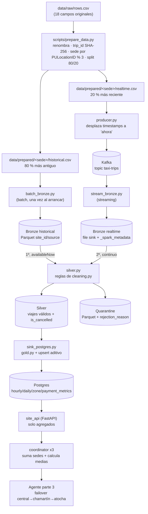

# Arquitectura — Parte 2: Infraestructura de datos

Documento de referencia de `parte2_infraestructura_datos/`: qué problema
resuelve, cómo está montado, cómo fluyen los datos y qué hace cada
fichero.

> Estado a fecha de 27/09/2026: `main` con todas las issues de la parte 2
> integradas (#47–#70), incluidos los arreglos #90, #92 y #94.

---

## Índice

1. [Visión general](#1-visión-general)
2. [Topología: sedes y servicios](#2-topología-sedes-y-servicios)
3. [Flujo de datos de punta a punta](#3-flujo-de-datos-de-punta-a-punta)
4. [Etapas del pipeline en detalle](#4-etapas-del-pipeline-en-detalle)
5. [Esquema canónico y contratos de datos](#5-esquema-canónico-y-contratos-de-datos)
6. [Coordinador replicado y failover](#6-coordinador-replicado-y-failover)
7. [Despliegue](#7-despliegue)
8. [Monitorización](#8-monitorización)
9. [Referencia fichero a fichero](#9-referencia-fichero-a-fichero)
10. [Decisiones de diseño clave](#10-decisiones-de-diseño-clave)
11. [Limitaciones y trabajo pendiente](#11-limitaciones-y-trabajo-pendiente)

---

## 1. Visión general

La plataforma procesa viajes de taxi (dataset NYC Taxi) repartidos entre
**tres sedes independientes**: **Central**, **Chamartín** y **Atocha**.

Cada sede:

- tiene **sus propios datos** (ninguna sede ve los viajes de otra);
- procesa esos datos con su propio pipeline, que sigue la arquitectura
  **medallion**: **Bronze** (crudo) → **Silver** (limpio) → **Gold**
  (agregados de negocio);
- expone hacia fuera **solo agregados combinables** (conteos y sumas),
  nunca viajes individuales ni medias.

Encima de las tres sedes está el **coordinador**. Pide los agregados a
las tres, los suma y calcula las medias globales **una única vez**. Es
stateless y se replica en las tres sedes. El orden de failover es
Central → Chamartín → Atocha.

El consumidor final es el **agente conversacional de la parte 3**.
Pregunta al coordinador y nunca habla directamente con
las sedes.

### Tecnologías

| Pieza | Tecnología |
|---|---|
| Preparación de datos | Python + pandas |
| Simulación de tiempo real | Python + `kafka-python` |
| Bus de mensajes | Apache Kafka 3.8 (modo KRaft, un nodo por sede) |
| Procesamiento | PySpark 4.2 (Structured Streaming) |
| Lakehouse | Parquet en volumen docker, particionado por `site_id` / `source` |
| Almacén Gold | PostgreSQL 16 (una instancia por sede) |
| APIs | FastAPI + uvicorn (`psycopg2` en `site_api`, `httpx` en el coordinador) |
| Despliegue | Docker Compose + Makefile |
| Monitorización | Prometheus + Grafana (nodo central) |

---

## 2. Topología: sedes y servicios

Las tres sedes usan **la misma plantilla** (`deploy/docker-compose.site.yml`).
Solo cambia el `.env` (`sites/<sede>.env`). Cada sede es un proyecto
compose aislado (`-p <sede>`) con su propia red interna `site`. La red
compartida `pids-interconnect` solo une las piezas que tienen que
hablar entre sedes: `site_api` y `coordinator`.

```
 ┌──────────────────── SEDE (x3: central / chamartin / atocha) ───────────────────┐
 │  red interna "site"                                                            │
 │                                                                                │
 │  producer ──► kafka ──► spark_stream_bronze ──► [lakehouse: bronze/realtime]   │
 │  spark_batch_bronze (una vez) ────────────────► [lakehouse: bronze/historical] │
 │                                                        │                       │
 │                                             spark_silver                       │
 │                                                        ▼                       │
 │                                  [lakehouse: silver]  [lakehouse: quarantine]  │
 │                                                        │                       │
 │                                          spark_sink_postgres                   │
 │                                                        ▼                       │
 │                                                    postgres ◄── site_api ──────┼──┐
 │                                                                                │  │
 │  coordinator (profile "coordinator", opcional) ────────────────────────────────┼──┤
 └────────────────────────────────────────────────────────────────────────────────┘  │
                                                                                     │
          red compartida "pids-interconnect": site-api-central / -chamartin /        │
          -atocha + los coordinadores de las tres sedes  ◄───────────────────────────┘

 ┌──────── NODO CENTRAL: monitorización (compose aparte) ────────┐
 │  prometheus (:9090)  ──►  grafana (:3000)                     │
 └───────────────────────────────────────────────────────────────┘
```

### Puertos publicados en el host

| Sede | `site_api` | Postgres | Coordinador | Prioridad failover |
|---|---|---|---|---|
| central | 8000 | 5432 | 8100 | 1º (primario) |
| chamartin | 8001 | 5433 | 8101 | 2º (respaldo) |
| atocha | 8002 | 5434 | 8102 | 3º (respaldo) |

Prometheus usa el 9090 y Grafana el 3000; los dos van en el compose central.

Kafka no publica puerto en el host: solo lo usan los contenedores de su
sede (`kafka:9092`). Todas las sedes usan el topic `taxi-trips`, pero
cada una tiene **su propio broker**, así que los mensajes nunca se
mezclan.

---

## 3. Flujo de datos de punta a punta



La vida de un viaje, resumida:

1. **Preparación (una sola vez).** El viaje sale de `rows.csv` con los
   nombres de columna canónicos, un `trip_id` determinista, una sede
   asignada y una etiqueta `historical` o `realtime`.
2. **Entrada a Bronze.**
   - Si es `historical`, lo carga `batch_bronze.py` directamente desde el CSV.
   - Si es `realtime`, el `producer` lo publica en Kafka "como si
     ocurriera ahora" y `stream_bronze.py` lo recoge.
   - En los dos casos se le pone `ingest_ts`. El histórico acaba en
     `bronze/historical` y el realtime en `bronze/realtime`.
3. **Silver.** `silver.py` procesa primero todo el histórico y después
   sigue el realtime, con el mismo código y las mismas reglas. Aplica las reglas de calidad: el viaje
   válido va a Silver y el inválido a cuarentena con los motivos del
   rechazo.
4. **Gold.** `sink_postgres.py` lee Silver en streaming, calcula los
   agregados parciales de cada micro-batch (con las funciones de
   `gold.py`) y los **suma** en Postgres mediante un upsert.
5. **Salida.** `site_api` sirve esos agregados (conteos y sumas) por HTTP.
6. **Combinación.** El coordinador pide los agregados a las tres
   `site_api`, los suma por clave y calcula las medias globales.
7. **Consumo.** El agente pregunta al coordinador. Si Central no
   responde, prueba Chamartín y después Atocha.

---

## 4. Etapas del pipeline en detalle

### 4.1 Preparación — `scripts/prepare_data.py`

Se ejecuta una sola vez, fuera de Docker, desde `parte2_infraestructura_datos/`:

```bash
python -m scripts.prepare_data
```

| Paso | Qué hace |
|---|---|
| 1 | Lee `data/raw/rows.csv` y comprueba que están las 18 columnas originales. |
| 2 | Renombra a snake_case con `CSV_COLUMN_MAPPING` (`schema.py`). |
| 3 | Parsea las fechas con el formato `%m/%d/%Y %I:%M:%S %p`. Si una fecha no encaja, falla. |
| 4 | Genera `trip_id` = SHA-256 de los 18 campos unidos con `\|`. No se incluyen los metadatos de la plataforma, para que la identidad del viaje no dependa de dónde ni cómo se procese. |
| 5 | Asigna `site_id` con `PULocationID % 3`: 0 → central, 1 → chamartin, 2 → atocha. |
| 6 | Añade `schema_version = 1`. |
| 7 | Por sede, ordena por `pickup_datetime` y parte en 80 % `historical` y 20 % `realtime`. |
| 8 | Escribe los 6 CSV en `data/prepared/<sede>/`. |
| 9 | Valida el resultado: se conservan todas las filas, no hay nulos en metadatos, los enums son válidos, cada `pu_location_id` cae en una sola sede, y avisa si hay IDs duplicados. |

`ingest_ts` **no** se genera aquí: representa la entrada real al
pipeline, así que lo añade Bronze.

### 4.2 Simulación realtime — `src/producer/producer.py`

- Lee `data/prepared/<SITE_ID>/realtime.csv`. Se niega a arrancar si el
  fichero contiene filas de otra sede o con un `source` distinto de
  `realtime`.
- Calcula `time_shift = ahora − primer pickup` y lo suma a
  `pickup_datetime` y `dropoff_datetime`, de modo que se conserva la
  duración de cada viaje.
- Respeta el tiempo real entre viajes consecutivos dividido por
  `ACCELERATION_FACTOR`. Con el valor por defecto, 60, un minuto del
  dataset dura un segundo.
- Publica cada viaje como JSON en Kafka con `key = trip_id` y
  `acks="all"`.
- **No** recalcula `trip_id` después de mover los timestamps.

### 4.3 Bronze

Bronze es la **capa cruda**: el dato tal como entra, ya con los tipos
canónicos y `ingest_ts`, pero sin limpiar. Tiene dos raíces separadas:

- `data/lakehouse/bronze/historical/site_id=<sede>/source=historical/` (batch)
- `data/lakehouse/bronze/realtime/site_id=<sede>/source=realtime/` (streaming)

Van separadas a propósito: `stream_bronze.py` escribe con el *file sink* de
Spark, que deja un `_spark_metadata` en su carpeta, y cualquier lector de
esa carpeta solo ve los ficheros de ese registro. Si el batch escribiera en
la misma ruta, sus ficheros serían invisibles para Silver (#94).

| Job | Modo | Detalle |
|---|---|---|
| `batch_bronze.py` | batch | Lee el CSV **por nombre de columna**. Con un `.schema()` explícito Spark asignaría las columnas por posición y, como el orden del CSV no coincide con el de `TRIP_SCHEMA`, las desalinearía sin avisar. Después convierte cada columna a su tipo canónico y pone `ingest_ts`. Escribe en `bronze/historical`. Se despliega como servicio de una sola ejecución (`spark_batch_bronze`) y es **idempotente**: si el histórico de la sede ya está en Bronze no lo recarga, porque Silver lo volvería a procesar y Gold lo contaría dos veces (`FORCE_RELOAD=1` solo tras `make clean`). |
| `stream_bronze.py` | streaming | Lee Kafka desde `earliest`, parsea el JSON con `EVENT_SCHEMA` y los timestamps ISO-8601 con una UDF (`datetime.fromisoformat`, que tolera microsegundos). Convierte a los tipos canónicos, pone `ingest_ts` y hace append en `bronze/realtime` cada 10 s, con checkpoint. La función `parse_events` no depende de Kafka, así que se puede probar con un DataFrame estático. |

### 4.4 Silver — `src/spark_jobs/silver.py` + `src/common/cleaning.py`

Silver lee Bronze **como stream**, con dos queries seguidas dentro del mismo
job y un checkpoint cada una:

1. `bronze/historical` con `trigger(availableNow=True)`: procesa todo el
   histórico y termina (tras un reinicio no repite nada).
2. `bronze/realtime` en continuo. Antes de arrancar espera a que
   `stream_bronze.py` haya confirmado su primer micro-batch.

Las dos usan el mismo `process_batch`, así que el histórico y el realtime
pasan por las mismas reglas. No se unen en un solo stream ni se ejecutan a
la vez porque Spark 4.2 falla al unir dos *file streams* cuando solo uno trae
datos, y un stream arrancado sobre un sink aún vacío no detecta las columnas
de partición (#94).

Usa `foreachBatch` porque necesita **dos salidas** (válidos y
cuarentena) y una query de Structured Streaming solo admite un sink.

Esto es lo que hace `cleaning.split_valid_quarantine()` con cada
micro-batch:

1. `drop_duplicate_trips`: elimina duplicados por `trip_id`.
2. `flag_cancellations`: marca `is_cancelled = True` si hay algún importe
   negativo **y** `payment_type` es 3 (sin cargo) o 4 (disputa).
3. `apply_quarantine_rules`: evalúa todas las reglas y guarda en un array
   **todas** las que falla cada fila, no solo la primera.

| Regla | Rechaza si… |
|---|---|
| `missing_required_field` | Es nulo alguno de: `trip_id`, `site_id`, `source`, `schema_version`, `pickup_datetime`, `dropoff_datetime`, `pu_location_id`, `do_location_id`. |
| `invalid_enum_value` | `site_id` o `source` tienen un valor fuera de los permitidos. |
| `invalid_duration` | `dropoff ≤ pickup`. |
| `duration_too_long` | El viaje dura más de 180 minutos. |
| `negative_distance` | `trip_distance < 0`. |
| `invalid_passenger_count` | `passenger_count` es menor que 0 o mayor que 9. |
| `unexplained_negative_amount` | Hay algún importe negativo y **no** es una cancelación ni una disputa. |

**Qué no se rechaza, a propósito** (está razonado en el docstring de `cleaning.py`):

- Que `total_amount` no cuadre con la suma de sus componentes. Pasa en
  el 37 % de la muestra (casi todo VendorID 1, que mete el
  `congestion_surcharge` dentro de `extra`), así que como regla
  descartaría demasiados datos válidos.
- `passenger_count = 0`: el viaje sí ocurrió.

Salidas:

- `data/lakehouse/silver/site_id=/source=/`: viajes válidos (canónicos +
  `is_cancelled`).
- `data/lakehouse/quarantine/site_id=/`: filas rechazadas + `rejection_reason`
  (motivos separados por `;`) + `rejected_at`.

### 4.5 Gold — `src/spark_jobs/gold.py` + `sink_postgres.py`

`gold.py` es una **biblioteca de agregados**. Tiene cuatro funciones que
reciben un DataFrame y devuelven el agregado **parcial** de ese input:

| Tabla | Agrupa por | Clave primaria |
|---|---|---|
| `hourly_metrics` | hora de `pickup_datetime` (`date_trunc`) | `(site_id, trip_hour)` |
| `daily_metrics` | fecha de `pickup_datetime` | `(site_id, trip_date)` |
| `zone_metrics` | `pu_location_id` | `(site_id, pu_location_id)` |
| `payment_metrics` | `payment_type` | `(site_id, payment_type)` |

Cada fila lleva `trip_count`, `sum_fare_amount`, `sum_trip_distance`,
`sum_tip_amount` y `sum_total_amount`. **Nunca medias**, y siempre
**sin los viajes cancelados** (siguen en Silver, pero no cuentan como
ingresos ni como volumen).

El `main` de `gold.py` escribe en Parquet (`lakehouse/gold`). Es un
destino provisional para probar en local y **no está desplegado**.

`sink_postgres.py` es el job que sí se despliega:

1. Lee Silver en streaming.
2. En cada micro-batch intenta insertar `(job, sede, batch_id)` en la
   tabla de control `processed_batches`. Si ya estaba, es un reintento y
   **salta el batch**, para no sumar dos veces.
3. Calcula las 4 tablas con las funciones de `gold.py`, las recoge en el
   driver (son muy pocas filas) y hace el upsert:
   `INSERT … ON CONFLICT (clave) DO UPDATE SET col = tabla.col + EXCLUDED.col`.
4. La tabla de control y los 4 upserts van en **una sola transacción**:
   o entra el batch entero o no entra nada.

### 4.6 Postgres — `sql/`

`docker-entrypoint-initdb.d` lo inicializa en el primer arranque:

- `init.sql` crea las 4 tablas Gold. Tienen un `CHECK` sobre `site_id`
  y las columnas `sum_*` son `NUMERIC` sin precisión fija, para que la
  suma acumulada nunca desborde.
- `quarantine.sql` crea `silver_rejected` (columnas nullable, porque ahí
  van precisamente las filas con nulos) y un índice por `site_id`.
- `processed_batches` no está en `sql/`: la crea `sink_postgres.py`
  porque es un detalle suyo de implementación.

### 4.7 API de sede — `src/site_api/main.py`

Es **la única puerta de salida** de los datos de una sede. Todas las
consultas filtran `WHERE site_id = SITE_ID` (defensa en profundidad) y
usan un pool de 1 a 5 conexiones.

| Endpoint | Filtros | Devuelve |
|---|---|---|
| `GET /health` | — | `{"status","site_id"}` |
| `GET /metrics/hourly` | `date_from`, `date_to` (datetime) | filas de `hourly_metrics` |
| `GET /metrics/daily` | `date_from`, `date_to` (date) | filas de `daily_metrics` |
| `GET /metrics/zone` | `pu_location_id` | filas de `zone_metrics` |
| `GET /metrics/payment` | `payment_type` | filas de `payment_metrics` |
| `GET /quarantine/summary` | `date_from`, `date_to` sobre `rejected_at` | `rejection_reason` + `rejected_count` |

Si falla la base de datos devuelve **503**. Nunca devuelve filas de
viajes individuales, ni siquiera de la cuarentena.

---

## 5. Esquema canónico y contratos de datos

### `TRIP_SCHEMA` (`src/common/schema.py`), `schema_version = 1`, 23 campos

| Grupo | Campos | Tipo |
|---|---|---|
| Metadatos | `trip_id`, `site_id`, `source` | string (no nulos) |
| | `schema_version` | int (no nulo) |
| | `ingest_ts` | timestamp (no nulo) |
| Viaje | `vendor_id`, `passenger_count`, `ratecode_id`, `pu_location_id`, `do_location_id` | int |
| | `pickup_datetime`, `dropoff_datetime` | timestamp (no nulos) |
| | `trip_distance` | double |
| | `store_and_fwd_flag` | string |
| Pago | `payment_type` | int |
| | `fare_amount`, `extra`, `mta_tax`, `tip_amount`, `tolls_amount`, `improvement_surcharge`, `total_amount`, `congestion_surcharge` | `Decimal(12,2)` |

Valores permitidos:

- `site_id` ∈ {`central`, `chamartin`, `atocha`}
- `source` ∈ {`historical`, `realtime`}

### Qué metadato se genera en cada punto

| Campo | Quién lo pone |
|---|---|
| `trip_id`, `site_id`, `source`, `schema_version` | `prepare_data.py` (el producer reafirma `schema_version`) |
| `ingest_ts` | `batch_bronze.py` / `stream_bronze.py` |
| `is_cancelled` | `cleaning.py` (Silver) |
| `rejection_reason`, `rejected_at` | `cleaning.py` (cuarentena) |

### Contrato "agregados combinables"

Es la regla que atraviesa toda la parte 2:

> Gold, la `site_api` y lo que viaja entre sedes son **conteos y sumas**.
> Las medias se calculan **una vez, en el coordinador**, como
> `Σ sumas / Σ conteos`.

Si cada sede devolviera su media y el coordinador las promediara, el
resultado sería erróneo en cuanto las sedes tuvieran volúmenes distintos
(en la revisión de arquitectura del grupo, el error era de un ~13 % en
un ejemplo). Por eso las columnas llevan el prefijo `sum_`: recuerdan
que se suman, no que se promedian.

---

## 6. Coordinador replicado y failover

### Qué hace — `src/coordinator/`

- **`clients.py`** llama a las tres `site_api` **en paralelo**
  (`asyncio.gather`). Cada llamada tiene su propio timeout
  (`SITE_API_TIMEOUT_SECONDS`, 5 s por defecto) y su propio
  `try/except`. Una sede caída o lenta nunca bloquea ni tumba la
  respuesta: se convierte en `SiteResult(ok=False)`.
- **`main.py`** tiene un endpoint por cada `/metrics/*` de `site_api`.
  Suma `trip_count` y `sum_*` por clave (misma hora, fecha, zona o tipo
  de pago en las tres sedes) y calcula `avg_*` a partir de las sumas.

La respuesta tiene esta forma:

```json
{
  "sites_ok": ["atocha", "central", "chamartin"],
  "sites_failed": [],
  "partial": false,
  "data": [{ "trip_date": "...", "trip_count": 160, "sum_fare_amount": "1600", "avg_fare_amount": "10", "...": "..." }]
}
```

`GET /health` indica qué réplica responde:
`{"status":"ok","site_id":"chamartin","failover_priority":2}`.

### Dos tipos de tolerancia a fallos (no hay que confundirlos)

| Qué cae | Quién lo gestiona | Resultado |
|---|---|---|
| **La `site_api` de una sede** | El coordinador (`clients.py`) | Responde con las otras dos sedes, `partial: true` y la sede caída en `sites_failed`. |
| **Una réplica del coordinador** | El **cliente** (failover) | El cliente prueba la siguiente réplica en orden. |

### Replicación (issue #59)

El coordinador es **stateless**, así que no hace falta sincronizar nada
entre réplicas: se despliega la misma imagen en cada sede con el profile
`coordinator`. Cada réplica consulta las tres `site_api` a través de la
red compartida `pids-interconnect`, donde cada API tiene el alias
`site-api-<sede>`.

### Orden de failover

| Prioridad | Réplica | URL (host) |
|---|---|---|
| 1º | central | `http://localhost:8100` |
| 2º | chamartin | `http://localhost:8101` |
| 3º | atocha | `http://localhost:8102` |

Reglas para el cliente (implementadas en `scripts/coordinator_failover.py`):

1. Se prueba la réplica de mayor prioridad.
2. Si no conecta, hay timeout o devuelve `5xx`, se pasa a la siguiente.
3. Si devuelve `4xx`, **no** se reintenta en las demás: todas ejecutan el
   mismo código y fallarían igual.
4. Si no responde ninguna, se devuelve un error (el script sale con código 1).
5. El timeout del cliente (10 s) es mayor que el del coordinador con cada
   sede (5 s): si no, una sola sede colgada haría que el cliente descartara
   la respuesta parcial de todas las réplicas (lo detectó M1, #90).

Las URLs se pueden cambiar con `COORDINATOR_URLS` (separadas por comas y
en orden de failover).

---

## 7. Despliegue

### Requisitos previos

1. Tener `data/raw/rows.csv` y ejecutar `python -m scripts.prepare_data`
   para generar `data/prepared/`.
2. Docker con Compose v2 y `make`. El Makefile usa sintaxis `sh`, así que
   en Windows hay que ejecutarlo desde WSL o Git Bash con `make`.
3. Ejecutar todo desde `parte2_infraestructura_datos/`.

### Comandos (Makefile)

| Comando | Qué hace |
|---|---|
| `make up SITE=<sede>` | Crea la red compartida si no existe y levanta la sede sin coordinador. Reconstruye las imágenes si cambió el código (`--build`). |
| `make up-coordinator SITE=<sede>` | Igual que `up`, pero con el coordinador de esa sede. |
| `make up-all` / `make up-all-coordinators` | Las tres sedes, sin o con coordinador. |
| `make stop-coordinator SITE=<sede>` | Para solo el coordinador (útil para la demo de failover). |
| `make failover-check [FAILOVER_PATH=/metrics/daily]` | Consulta el coordinador con failover. |
| `make down` / `down-all` | Para y elimina los contenedores. |
| `make clean SITE=<sede>` | `down -v`: **borra** Postgres, el lakehouse y los checkpoints. |
| `make logs` / `ps` / `config` / `build` / `restart` | Lo habitual de compose, para la sede indicada. |

Por dentro, cada comando ejecuta:

```bash
docker compose -p <sede> --env-file sites/<sede>.env -f deploy/docker-compose.site.yml [--profile coordinator] ...
```

### Volúmenes por sede

| Volumen | Contenido |
|---|---|
| `pgdata` | Postgres (Gold + cuarentena + `processed_batches`) |
| `lakehouse` | `bronze/historical/`, `bronze/realtime/`, `silver/`, `quarantine/` |
| `checkpoints` | Offsets y estado de cada query de streaming |

`data/` del host se monta **en solo lectura** en el producer (para el
`realtime.csv`) y `data/prepared/` en `spark_batch_bronze` (para el
`historical.csv`).

### Arranque y dependencias entre servicios

```
kafka (healthy) ──► producer
                └─► spark_stream_bronze ──► spark_silver ──┐
spark_batch_bronze (terminado OK) ──────────►──┘            │
postgres (healthy) ────────────────────────────────────────┴─► spark_sink_postgres
postgres (healthy) ──► site_api
coordinator (profile) ──► depende solo de la red compartida; tolera sedes caídas
```

### Demo de failover

```bash
make up-all-coordinators
make failover-check                    # Answered by: :8100 → central
make stop-coordinator SITE=central
make failover-check                    # Skipped :8100 → Answered by :8101 → chamartin
make failover-check FAILOVER_PATH=/metrics/daily
```

---

## 8. Monitorización

Va en un compose aparte, `deploy/docker-compose.central.yml`:

- **Prometheus** (`:9090`) lee `monitoring/prometheus.yml` y recoge:
  - `site_api` de cada sede por `/prometheus` (peticiones por endpoint y
    estado, latencias); se usa `/prometheus` porque `/metrics/*` son los
    endpoints de negocio;
  - el producer de cada sede (`trips_processed_total`) en los puertos
    9000–9002.

  Como cada sede es un proyecto compose con su red, Prometheus las alcanza
  por los puertos publicados en el host (`host.docker.internal`). Con Docker
  Engine en Linux/WSL hay que añadir
  `extra_hosts: ["host.docker.internal:host-gateway"]` al servicio.
- **Grafana** (`:3000`, admin/admin por defecto) se autoprovisiona con
  Prometheus como datasource y dos dashboards
  (`monitoring/grafana/provisioning/dashboards/`): **negocio** y
  **operacional**.

El coordinador todavía no expone métricas (su job está comentado en
`prometheus.yml`).

---

## 9. Referencia fichero a fichero

### Raíz

| Fichero | Descripción |
|---|---|
| `README.md` | Puesta en marcha, operación, consulta de los datos, tests y métricas, esquema canónico y limitaciones. |
| `ARQUITECTURA.md` | Este documento. |
| `COMPARATIVA.md` | Alternativas evaluadas por capa y adaptación a E3, E4 y E8 (#69). |
| `Makefile` | Envuelve `docker compose` por sede (ver §7). Usa `>` como prefijo de receta en vez del tabulador. |
| `requirements.txt` | Dependencias compartidas por todas las imágenes: pandas, pyspark 4.2, kafka-python, psycopg2, fastapi, uvicorn, httpx, prometheus-client. |
| `requirements-dev.txt` | `requirements.txt` + pytest. No se instala en las imágenes. |
| `pytest.ini` | Configuración de pytest (`pythonpath = .`, marcador `integration`). |

### `data/`

| Ruta | Descripción |
|---|---|
| `data/raw/` | Dataset original (`rows.csv`). No se modifica nunca. |
| `data/prepared/<sede>/` | Salida de `prepare_data.py`: `historical.csv` y `realtime.csv`. |
| `data/lakehouse/`, `data/checkpoints/` | Solo existen si se ejecuta en local. En Docker viven en volúmenes. |

### `scripts/`

| Fichero | Descripción |
|---|---|
| `prepare_data.py` | Preparación única del dataset (§4.1). |
| `coordinator_failover.py` | Cliente de referencia del coordinador con failover Central → Chamartín → Atocha (§6), con timeout de 10 s. Sirve para la demo, para los tests de M1 y como contrato para el agente de la parte 3. |

### `src/common/` — código compartido por todos los servicios

| Fichero | Descripción |
|---|---|
| `schema.py` | Fuente única de verdad: `SCHEMA_VERSION`, `VALID_SITE_IDS`, `VALID_SOURCES`, `CSV_COLUMN_MAPPING`, `TRIP_FIELDS` (base del `trip_id`) y `TRIP_SCHEMA` (Spark). Se autovalida con `python -m src.common.schema`. |
| `cleaning.py` | Reglas de calidad y separación entre válidos y cuarentena (§4.4). Tiene un smoke test en `__main__` sobre `central/historical.csv`. |

### `src/producer/`

| Fichero | Descripción |
|---|---|
| `producer.py` | Simulador realtime: CSV → Kafka con timestamps desplazados y velocidad acelerada (§4.2). |
| `Dockerfile` | `python:3.12-slim` + requirements + `src/common` + `src/producer`. Los datos se montan en tiempo de ejecución. |

### `src/spark_jobs/`

| Fichero | Descripción |
|---|---|
| `batch_bronze.py` | Carga el histórico: CSV → `bronze/historical` (§4.3). Servicio de una sola ejecución `spark_batch_bronze`; idempotente. |
| `stream_bronze.py` | Kafka → `bronze/realtime` en streaming (§4.3). Es el único job que necesita el conector Kafka (`PYSPARK_SUBMIT_ARGS --packages`). |
| `silver.py` | Bronze → Silver + cuarentena: primero el histórico y después el realtime en continuo (§4.4). |
| `gold.py` | Funciones de agregados combinables. Su `main` escribe Parquet provisional y no se despliega (§4.5). |
| `sink_postgres.py` | Silver → Gold en Postgres con upsert aditivo idempotente (§4.5). |
| `Dockerfile` | `python:3.12-slim-bookworm` + OpenJDK 17 (la JVM que necesita Spark). La base está fijada a Debian 12 porque Debian 13 ya no incluye OpenJDK 17 (#92). El job concreto se elige con el `command` del compose. |

Todos los jobs de streaming aceptan `RUN_MODE=continuous` (por defecto,
trigger cada `TRIGGER_INTERVAL_SECONDS`) o `RUN_MODE=once`
(`availableNow`: procesa lo pendiente y termina; útil para pruebas sin
Kafka). Además, todos validan `SITE_ID` y filtran por él.

### `src/site_api/`

| Fichero | Descripción |
|---|---|
| `main.py` | API FastAPI de la sede (§4.7). |
| `Dockerfile` | `python:3.12-slim`, uvicorn en el `:8000`. |

### `src/coordinator/`

| Fichero | Descripción |
|---|---|
| `clients.py` | Llamadas concurrentes a las tres `site_api` con timeout y aislamiento de errores. URLs configurables con `SITE_API_URL_<SEDE>`. |
| `main.py` | Combina los agregados, calcula las medias, expone `/health` con la prioridad de failover y valida la configuración al arrancar. |
| `Dockerfile` | `python:3.12-slim`, uvicorn en el `:8000`. |

### `sql/`

| Fichero | Descripción |
|---|---|
| `init.sql` | Las 4 tablas Gold (§4.6). |
| `quarantine.sql` | Tabla `silver_rejected` (§4.6). |

### `sites/`

| Fichero | Descripción |
|---|---|
| `central.env`, `chamartin.env`, `atocha.env` | Configuración por sede: `SITE_ID`, puertos (API, Postgres, coordinador), credenciales de desarrollo, topic, aceleración, versión de Spark. |
| `.env.example` | Plantilla comentada, incluidas las variables opcionales para desplegar en varias máquinas. |

### `deploy/`

| Fichero | Descripción |
|---|---|
| `docker-compose.site.yml` | Plantilla de **una** sede: kafka, postgres, producer, 3 jobs de Spark, site_api y coordinator (profile). Redes `site` (interna) e `interconnect` (externa y compartida). |
| `docker-compose.central.yml` | Stack de monitorización: Prometheus + Grafana. |

### `monitoring/`

| Fichero | Descripción |
|---|---|
| `prometheus.yml` | Configuración de scrape: `site_api` y producer de las tres sedes (§8). |
| `grafana/provisioning/datasources/datasource.yml` | Datasource de Prometheus. |
| `grafana/provisioning/dashboards/dashboards.yml` | Proveedor de dashboards por fichero. |
| `grafana/provisioning/dashboards/negocio.json`, `operacional.json` | Dashboards de negocio y operacional. |

### `tests/`

| Fichero | Descripción |
|---|---|
| `conftest.py` | Configuración común: URLs de las sedes, opción `--integration`, simulación de sedes con `httpx.MockTransport`, control de Docker y escritura de resultados. |
| `test_m1_availability.py` | M1 · Disponibilidad con sedes caídas (#66): degradación parcial y failover, en unitario y con contenedores reales. |
| `test_m2_transfer.py` | M2 · Transferencia de datos crudos (#67): contrato de las APIs, tráfico real y superficie de exposición. |
| `test_m3_accuracy.py` | M3 · Exactitud federada (#68): referencia centralizada independiente frente a cada sede y el coordinador. |
| `results/` | Cifras medidas de cada métrica (`.md` y `.json`). |

---

## 10. Decisiones de diseño clave

| Decisión | Motivo |
|---|---|
| **Reparto por `PULocationID % 3`** | Es determinista y todos los viajes de una zona van a la misma sede. Es una partición técnica, no geográfica. |
| **`trip_id` = SHA-256 de los campos originales** | El dataset no trae un ID. Así el ID es estable aunque el producer mueva los timestamps, y permite deduplicar. |
| **Split 80/20 cronológico por sede** | El tramo realtime es el futuro del histórico, igual que en un sistema real. |
| **`Decimal(12,2)` para importes** | Evita los errores de redondeo del punto flotante con dinero. |
| **Mismo código para histórico y realtime** | Silver procesa las dos raíces de Bronze con el mismo `process_batch`, así que las reglas no pueden divergir entre los dos caminos. |
| **Bronze separado en `historical/` y `realtime/`** | El *file sink* de streaming oculta los ficheros ajenos a su `_spark_metadata`; separar las raíces es lo que permite que el histórico llegue a Gold (#94). |
| **Cuarentena en lugar de descartar** | Las filas malas quedan auditables y con sus motivos. |
| **Cancelaciones marcadas, no rechazadas** | Son eventos de negocio legítimos: se quedan en Silver pero no cuentan en Gold. |
| **Solo agregados combinables fuera de la sede** | Evita el error de la "media de medias" y además ningún viaje individual sale de su sede. |
| **Upsert aditivo + `processed_batches`** | `foreachBatch` entrega *at-least-once*. La tabla de control lo convierte en efectivamente *exactly-once* en Postgres. |
| **Una transacción por micro-batch** | Un fallo a mitad de batch no deja actualizaciones parciales difíciles de detectar. |
| **Parquet plano, sin Delta ni Iceberg** | Mantiene simple la prueba de concepto. Se podría cambiar tocando solo la ruta y el formato de escritura. |
| **Coordinador stateless, failover en el cliente** | Las réplicas no se tienen que sincronizar ni elegir líder. Basta con un orden fijo conocido por el cliente. |
| **Red docker compartida solo para APIs y coordinadores** | Kafka, Postgres y Spark siguen aislados dentro de cada sede. Entre sedes solo se habla por HTTP. |
| **Una plantilla de compose + un `.env` por sede** | No hay tres ficheros de despliegue casi iguales que mantener. |

---

## 11. Limitaciones y trabajo pendiente

| # | Tema | Detalle |
|---|---|---|
| 1 | **Reejecutar el producer duplica el realtime** | `make up` sobre una sede con datos relanza el producer (que había terminado con `Exited (0)`) y vuelve a publicar todos los viajes. Como la deduplicación solo actúa dentro del micro-batch, Gold los cuenta dos veces. Hasta corregirlo, reiniciar con `make clean`. |
| 2 | **La deduplicación es solo dentro del micro-batch** | `dropDuplicates(["trip_id"])` no tiene estado entre batches. Solución natural: deduplicación con estado en Spark o un formato transaccional con `MERGE` (Delta/Iceberg). |
| 3 | **La cuarentena no llega a Postgres** | `silver.py` escribe la cuarentena en Parquet y ningún job la vuelca a `silver_rejected`, así que `/quarantine/summary` devuelve `[]`. |
| 4 | **Postgres publica su puerto en el host** | 5432–5434 con credenciales de desarrollo; `silver_rejected` puede guardar viajes completos. Es la única vía de salida de datos no agregados (M2 la marca como fallo conocido). |
| 5 | **Checkpoints y `processed_batches` van acoplados** | Si se borran los checkpoints de `sink_postgres` pero no Postgres, los `batch_id` vuelven a empezar en 0 y se saltarían como "ya procesados". `make clean` borra las dos cosas a la vez, así que no pasa si se usa ese comando. |
| 6 | **Coordinador sin métricas** | Solo la `site_api` y el producer exponen métricas a Prometheus. |
| 7 | **Credenciales de desarrollo** | `pids/pids` en los `.env` y `admin/admin` en Grafana. |
| 8 | **`gold.py` escribe Parquet** | Su `main` es solo para pruebas en local. En el despliegue lo sustituye `sink_postgres.py`. |
| 9 | **Consumo de memoria** | Cada job de Spark es una JVM de ~0,7 GB; las tres sedes completas ocupan unos 8–9 GB. |
